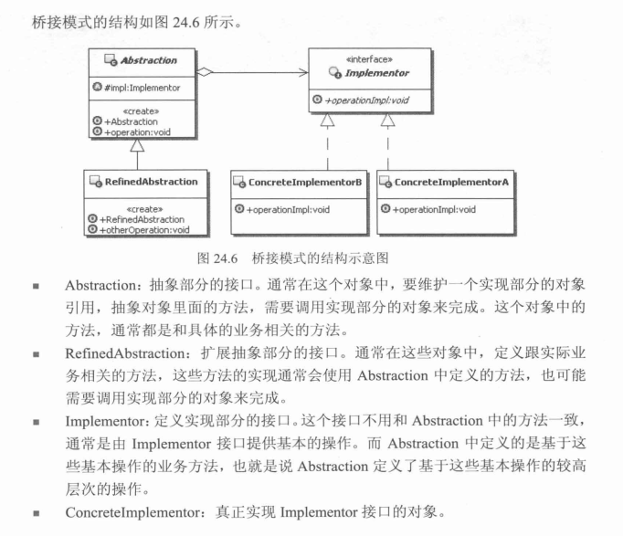

[TOC]

# 桥链模式

## 定义
    将抽象部分和它的实现分离，使他们都可以独立的变化。

## 发送消息问题分析
    消息：普通消息、加急消息、特急消息
    放松方式：站内信、Email、SMS
    便于扩展的方案是消息和发送消息耦合在一起。如下接口定义
```java
public interface Message {
  //此抽象将消息和发送消息这2个可变的东西耦合在一起了，以至于一个变化不得不牵涉到另一方
  public void sendMsg(String msg,String toUser);

}

public class CommonMsgSMS implements Message {
  public void sendMsg(String msg,String toUser){
    //普通消息发送短信
  }
}

public class CommonMsgEmail implements Message {
  public void sendMsg(String msg,String toUser){
    //普通消息发送Email
  }
}

```
    要解决这个耦合问题，就必须把这2者抽象分离,改写如下
```java
//消息抽象，持有发送具体发送消息抽象
public abstract class Message {

  private SendMsg  sendMsg;

  public setSendMsg(SendMsg  sendMsg){
    this.sendMsg = sendMsg;
  }

  public void sendMsg(String msg,String toUser){
      sendMsg.sendMsg(String msg,String toUser);
  }
}

public abstract class SendMsg{
  public abstract  void sendMsg(String msg,String toUser);
}

public class SendMsgSMS{
  public void sendMsg(String msg,String toUser){
    //短信方式发送消息
  }
}

```

## UML


## Exmaple
```java
//第三方抽象
public interface Implementor {

  public void opertionImpl();

}

public class ConcreteImplementorA implements Implementor {
  public void opertionImpl(){
    //dosoming a
  }
}

public class ConcreteImplementorB implements Implementor {
  public void opertionImpl(){
    //dosoming b
  }
}

//抽象接口
public abstract class Abstraction {

  //抽象的服务，此服务实现方式可能由于具体抽象对象而变化，所以仍需要抽象
  //未了抽象此服务，引入第三方抽象接口(Implementor)
  public void opertion(){
    impl.opertionImpl();//抽象实现
  }

  protected Implementor impl;

  public Abstraction(Implementor impl){
    this.impl = impl;
  }
}

public class RefindeAbstraction extends Abstraction {

  public RefindeAbstraction(Implementor impl){
    super(impl);
  }

  //其它操作
  public void otherOpertion(){
    //实现一定的功能，可能会使用具体实现部分的实现方法
    //但是本地方法更大的可能是使用Abstraction中定义的方法
    //通过组合Abstraction定义的方法实现更多功能
  }

}


```
