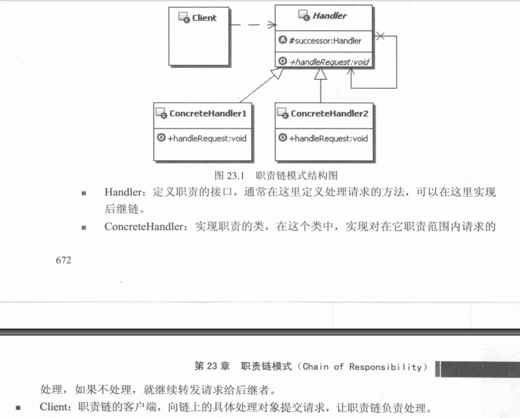

# 职责链模式


## 问题抽象
    客户端发出一个请求，会有很多的对象都可以来处理这个请求，而且不同的对象的处理逻辑不
    一定是一样的。
    客户端：不关心由谁来处理，我只希望尽早得到处理结果的反馈
    处理请求的对象：能够方便的修改甚至被替换掉

## 职责链模式定义
    使多个对象都有机会处理请求，从而避免请求发送者和接受者之间的耦合关系。将这些对象链
    成一条链，并沿着这条链传递该请求，直到有一个对象该请求为止。

## UML


## Example
 ```java
//职责的接口，也就是处理请求的接口
//之所以实现为抽象是因为接口有共同需要处理的东西
 public abstract  class Handler {
   //持有后继的职责处理对象
   protected Handler successor;
   //设置后继职责对象
   public void setSuccessor(Handler successor){
    this.successor = successor;
   }
  //示意请求方法，虽然这个示意是没有传递参数的，但实际情况确是可以传递参数的
  //根据需求决定是否传递参数
   public abstract void handlerRequest();
 }

//具体的职责对象
public class ConcreteHandler1 extends Handler{

  public void handlerRequest(){
    //根据某些条件判断是否属于自己处理的职责范围
    //判断条件可以从外部传入或者主动去获取的外部数据，如从数据库等获取
    //以下只是简单示意
    boolean someCondition = false;
    if (someCondition) {//属于自己的请求
      //
      System.out.println("ConcreteHandler1 handler request");
    }else{//不属于自己的请求，如果有后继职责对象，就交于后继职责对象处理
        if (this.successor!=null) {
            this.successor.handlerRequest();
        }
    }

  }

}
//ConcreteHandler2 代码类似这里不做再次说明

//客户端
public class Client{

  public static void main(String[] args) {
    //组装职责链
    Handler h1 = new ConcreteHandler1();
    Handler h2 = new ConcreteHandler1();
    h1.setSuccessor(h2);

    //提交请求
    h1.handlerRequest();
  }
}

 ```

## 个人理解
    职责链模式的关键是，有一批责任对象都有处理某一请求的责任，只是是否处理由请求的优先
    级决定，如果部分请求只需要一部分责任对象来处理就好了，并不会到达优先级比较高的责任
    处理对象，这里的职责链的关键处理负有处理请求的责任之外，还有转交请求的责任，如果客
    户端的请求自己处理不了，则应该交比自己优先级高的责任对象处理，所以责任对象负有责任
    包含1.处理请求 2.处理请求的过程发现处理权限不够则把请求向上转交，交于等级高的责任
    对象处理
