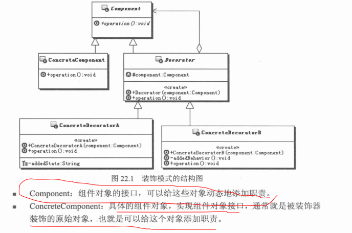
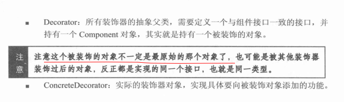

# 装饰模式

## 问题抽象
    设计一个计算奖金的对象，现在需要能够灵活地给他增加和减少功能，还能够动态的组合功能，
    每个功能就相当于计算奖金的某个部分。

## 定义
    动态的给一个对象添加一些额外的职责。就增加功能来说，装饰模式比生成子类更灵活。
## UML



## Exmaple
```java

//抽象组件
public abstract class Component{

//示例方法
  public abstract void opertion();

}

//具体的组件
public class ConcreteComponent extends Component {
  public void opertion(){
    //do something
  };
}

//装饰器共同的接口
public abstract class Decorator extends Component {

  //持有组件接口，其实就是持有被装饰的对象
  protected Component component;

  public Decorator(Component component){
    this.component = component;
  }

  public void opertion(){
    component.opertion();//请求转发至被装饰的对象,可以在转发前后执行一些附加动作
  };

}
//装饰器的具体实现对象，向组件对象添加职责
public class ConcreteDecoratorA extends Decorator {

  public ConcreteDecoratorA(Component component){
    super(component);
  }

  //添加的状态
  private String addedState;

  public String getAddedState(){
    return addedState;
  }

  public void setAddedState(String state){
    this.state = state;
  }

  public void opertion(){
    //调用父类方法，可以在调用前后执行一些附加动作，类似代理啊。。。
    //在这里进行处理的时候可以使用添加的状态
    super.opertion();
  };

}

//装饰器的具体实现对象，向组件对象添加职责
public class ConcreteDecoratorB extends Decorator {


  public ConcreteDecoratorB(Component component){
    super(component);
  }

  //添加职责
  private void addedBehavior(){
    //do
  }

  public void opertion(){
    //调用父类方法，可以在调用前后执行一些附加动作
    super.opertion();
    this.addedBehavior();
  };

}
```

## 模式说明
    在装饰模式中为了实现装饰者和被装饰者的无缝结合，通过让其共同实现相同的接口(实现公共)
    抽象类
    装饰器是用来装饰组件的，装饰器一定要实现和组件类一致的接口，保证他们是同一个类型，并
    具有同一个外观，这样组合完成的装饰才能够递归调下去。
    组件类是不知道装饰器存在的，装饰器为组件添加功能是一种**透明的包装**，组件类毫不知情
    ，需要**改变的是外部使用组件的地方**，现在需要使用装饰后的组件，接口是一样的，但是具
    体的实.
## 其它
    一个类的功能扩展方式，可以是继承，也可以是对象组合，优先采用对象组合
