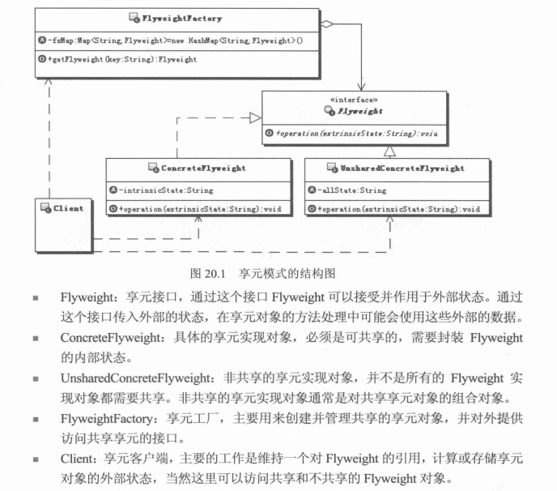

# 亨元模式

安全实体---数据
  就是被权限系统检测的对象，比如工资数据
权限---对数据的操作
  就是需要被校验的权限对象，比如查看、修改等


所谓授权---权限分配
  就是把某些安全实体的某些权限分配给某些人员的过程
所谓验证---权限匹配
  判断某个人对某个安全实体是否拥有某个或者某些权限的过程

亨原对象共享---拥有内部状态
其它数据不共享称为外部数据--拥有外部状态

设计重点就是在于分离变于不变，把一个对象的状态分为内部状态和外部状态，内部状态进行共享，
在亨原对象需要的时候可以从外部传入外部对象给亨原对象，共享对象在处理时候可以使用内部状态
和这些传递进去的外部对象

其实分离变与不变是软件设计的基础

比如预留接口就是为了以后扩展

亨元模式的本质是：分离与共享


## 定义
    运用共享技术有效的支持大量细颗粒度的对象

## UML



## Exmple
```java
//亨原接口，接受外部状态进行处理
public interface Flyweight {
  //接收外部状态进行处理
  public void operation(String externalState);
}

//具体的共享亨原对象
public class ConcerteFlyweight implements Flyweight{

  //内部状态
  private String internalState;

  public ConcerteFlyWeight(String internalState){
    this.internalState = internalState;
  }

  public void operation(String externalState){
    //do something
  }

}

//不共享的亨原对象
public class UnshareConcerteFlyweight implements Flyweight{
    public Sting allState;

    public void operation(String externalState){
      //do something
    }
}


//亨原工厂
public class FlyweightFactory{

private Map<String,Flyweight> fsmap = new HashMap<String,Flyweight>();

//获取亨原对象
public Flyweight getFlyweight(String key){
  //判断共享的亨原对象是否存在，存在则直接返回，不存在则创建并放入缓存
  Flyweight f = fsmap.get(key);

  if(f==null){
    f = new ConcerteFlyweight(key);
    fsmap.put(f);
  }else{
    return f;
  }

  }
}


public class Client{

}


```
