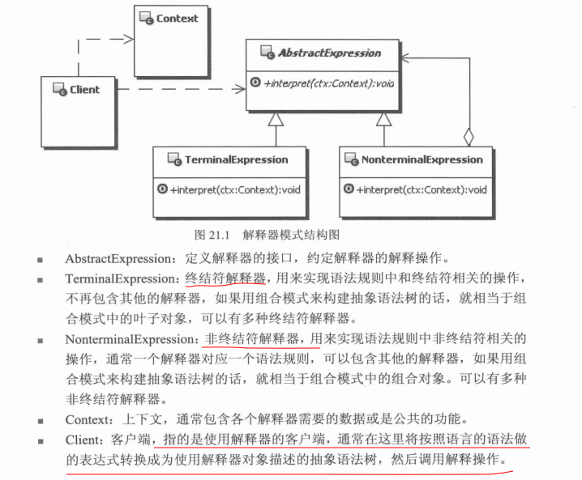

# 解释器模式

## 定义
    给定一个语言，定义它的文法的一种表示，并定义一个解释器，这个解释器使用该表示解释语言
    中的句子
    这里的文法，简单点说就是语法规则

## UML




## Exmple
```java
//上下文，包含解释器之外的一些全局信息
 pubic class Contenxt {

 }

//抽象表达式
public interface AbstractExpression {
  //解释操作接口，传入上下文对象(包含各个解释器需要的数据或是公共功能)
  public void interpret(Contenxt ctx);

}
//终结符表达式
public class TerminalExpression implements AbstractExpression {

  public void interpret(Contenxt ctx){
    //实现与语法规则中终结符相关的解释操作
  }

}


//非终结符表达式
public class NonTerminalExpression implements AbstractExpression {

  public void interpret(Contenxt ctx){
    //实现与语法规则中非终结符相关的解释操作
  }

}

//使用解释器的客户
public class Client{
  //主要按照语法规则对待特定的句子构建抽象语法树
  //然后调用解释操作
}

```

## 说明
要使用解释器模式最重要的是定义一套语法规则(文法)
