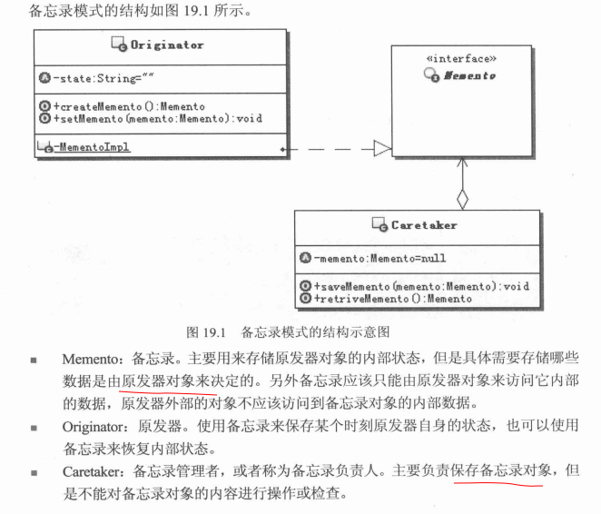

# 备忘录模式


## 模式定义
    在不破坏封装性的前提下，捕获一个对象的内部状态，并在该对象之外保存这个状态。这样以后
    就可将这个对象恢复到原先保存的状态
    说明:
    一个备忘录是一个对象，它存储另一个对象的某个瞬间的内部状态，后者被称为备忘录的原发器


## UML


### Example
```java
//原对象，私有备忘录实现，达到外部无法获取备忘录
public class Originator{
  //对象状态简单模拟
  private String state;

  //提供创建备忘录对象接口
  public void createMemento(){
      return new MementoImpl(this.state);
  }

  //提供状态复原接口
  public void recoverState(Memento memento){
    MementoImpl mementoImpl = (MementoImpl)memento;
    this.state = mementoImpl.getState();
  }


  private static class MementoImpl implements Memento{//备忘录实现,静态内部类
    //需可以记录原对象状态
    private String state;

    public MementoImpl(String state){
      this.state = state;
    }
    public String getState(){
      return state;
    }

  }


}


```
```java
//备忘录接口，为了把备忘录存储在外部
public interface Memento {

}

```
```java
//备忘录管理者，保存备忘录
public class CareTaker{

  private Memento memento;

  //保存备忘录
  public void saveMemento(Memento memento){
    this.memento = memento;
  }

  //获取备忘录
  public Memento getMemento(){
    this.memento;
  }

}

```

```java
public class Test{

  public static void main(String[] args) {

  }

}
```


## 其它

备忘录模式关键有2点：
  - 不破坏封装性
  - 捕获对象内部状态

为什么要捕获这个对象的内部状态？捕获这个内部状态有什么作用呢？

是为了在某个时候将对象的状态恢复至备忘录保存的状态，这才是备忘录的真正目的。
