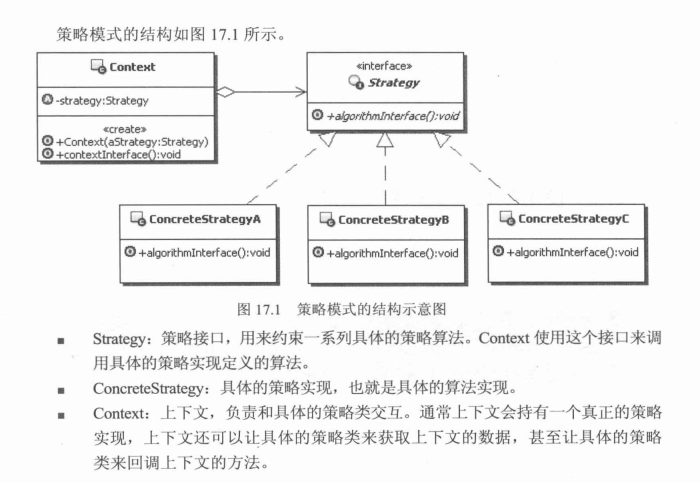
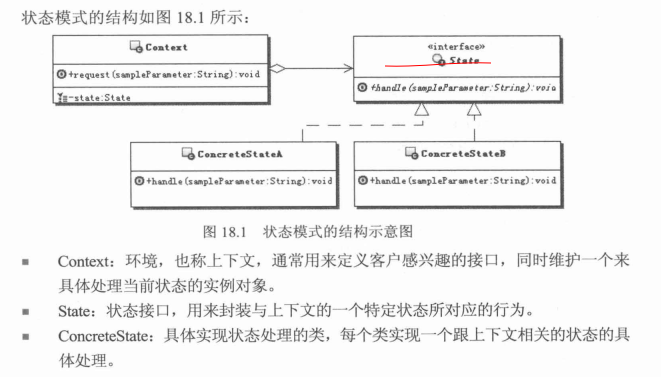

# 理解设计模式之策略模式、状态模式


## 策略模式
> 定义一系列的算法,把它们一个个封装起来, 并且使它们可相互替换。本模式使得算法可独立于
> 使用它的客户而变化。

### UML：



### Example
```java
public interface IStrategy {
    int doAlgorithm(int... array);
}
// 返回首元素
public class StrategyA implements IStrategy {
    @Override
    public int doAlgorithm(int... array) {
        return array[0];
    }
}
// 返回末元素
public class StrategyB implements IStrategy {
    @Override
    public int doAlgorithm(int... array) {
        return array[array.length - 1];
    }
}
public class Context {
    private IStrategy strategy;
    public void setStrategy(IStrategy strategy) {
        this.strategy = strategy;
    }
    public int getData(int... array) {
        // 不同的策略将会得到不同的结果
        return strategy.doAlgorithm(array);
    }
}
```
## 状态模式
>允许一个对象在它内部状态发生改变时改变它的行为，对象看起来似乎修改了它的类

### UML

### Example
```java
public interface State {

  public void handle(Object obj);

}

public class ConcreteStateA  implements State {
  public void handle(Object obj){
    //实现具体的处理


    //逻辑处理完之后，维护下一个状态
  };

}

public class ConcreteStateB  implements State {
  public void handle(Object obj){
    //实现具体的处理
    //dosomething

    //逻辑处理完之后，维护下一个状态
  };
}

/**
上下文持有状态对象，但是上下文自身并不处理跟状态有关的行为，而是把处理状态的功能委托给了
对应的状态处理类来处理
*/
public class Context{
  private State state;

  public  Context(State state){
    this.state = state;
  }

  public void request(Object obj){
    this.state.handle(obj);
  }

}


```


### 小结
这2个模式从结构上来看是一样的，但是实现的功能确实不一样的。
状态模式是根据状态的变化选择相应的行为，不同的状态对应不同的类，每个状态对象的实现类除了
实现该状态对应的功能外，还会维护状态数据的变化。另外这些实现状态的类之间是平行的不是平等
的，不能相互替换。
策略模式是根据需求或者客户端的要求先择相应的实现，各个实现类是平等的，可以相互替换，另外
策略模式可以让客户端选择相应的算法，而状态模式一般由上下文，或者在状态模式的实现类里面维
护具体状太数据，通常不由客户端指定状态
